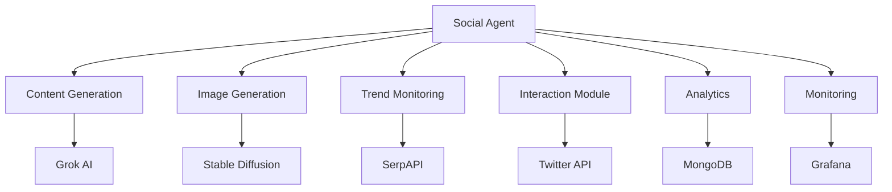

# Social Agent 🤖

A powerful social media automation tool built with Python, leveraging AI for content generation and engagement. This project demonstrates my skills in:
- Full-stack development
- AI integration
- API development
- Security best practices
- Docker containerization
- System monitoring

## 🚀 Features

- 🤖 AI-powered content generation using Grok
- 🖼️ Image generation with Stable Diffusion
- 📊 Analytics and performance tracking
- 🔄 Automated interactions and engagement
- 📈 Trend monitoring and analysis
- 🔒 Secure credential management
- 📝 Comprehensive logging and monitoring

## 🛠️ Technical Stack

- **Backend**: Python 3.9+
- **AI/ML**: Grok AI, Stable Diffusion
- **Database**: MongoDB
- **Containerization**: Docker
- **Monitoring**: Grafana
- **APIs**: Twitter, Grok, Modal, SerpAPI
- **Security**: Environment variables, Rate limiting, Input sanitization

## 🏗️ Architecture



## 🚀 Getting Started

1. Clone the repository:
```bash
git clone https://github.com/YOUR_USERNAME/social-agent.git
cd social-agent
```

2. Set up environment variables:
```bash
cp .env.example .env
```
Edit `.env` with your credentials (see Security section below)

3. Start with Docker:
```bash
docker-compose up -d --build
```

## 🔒 Security Implementation

This project implements several security best practices:

1. **Credential Management**:
   - Environment variables for sensitive data
   - Secure vault for credential storage
   - Git-secrets for preventing accidental commits

2. **API Security**:
   - Rate limiting implementation
   - Input sanitization
   - Error handling
   - Circuit breaker pattern

3. **Container Security**:
   - Read-only file systems
   - No new privileges
   - Internal networking
   - Health checks

4. **Monitoring**:
   - System metrics collection
   - API call tracking
   - Error logging
   - Performance monitoring

## 📊 Monitoring Dashboard

Access the Grafana dashboard at:
```
http://localhost:3000
```

## 🧪 Testing

Run tests with coverage:
```bash
pytest --cov=./
```

## 📚 Documentation

- [API Documentation](docs/api.md)
- [Architecture Overview](docs/architecture.md)
- [Security Guidelines](docs/security.md)

## 🤝 Contributing

Contributions are welcome! Please read our [Contributing Guidelines](CONTRIBUTING.md) first.

## 📄 License

This project is licensed under the MIT License - see the [LICENSE](LICENSE) file for details.

## 👨‍💻 Author

[Your Name]
- GitHub: [@omnipotence-eth](https://github.com/omnipotence-eth)
- LinkedIn: [Tremayne Timms](https://www.linkedin.com/in/tremayne-t-/)
